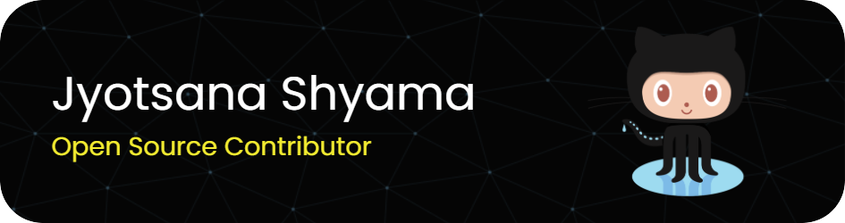

<h1 align="center">Hey there! 👋 Welcome to my GitHub profile</h1>
<h3 align="center">I am a 3rd Year B.Tech CSE student with a keen interest in DSA, AI/ML, and open-source contributions</h3>

<h2>My Projects</h2>

<h3>1. Twitter Sentiment Analysis</h3>

- Sentiment classification of tweets about the Pfizer vaccine (positive, negative, neutral)  
  - Applied Logistic regression model with hyperparameter tuning for improved performance  
  - <a href="https://github.com/jyotsanashyama/Twitter-Sentiment-Analysis">Click here for Source code</a>  
  - <a href="https://twitter-sentimentanalysis.streamlit.app/">Click here for deployed app </a>

<h3>2. Jeevan Rakshan Blood Bank Website</h3>

- Deployed a fully functioned Blood bank with interactive form for user information  
  - <a href="https://github.com/jyotsanashyama/jyotsanashyama.github.io">Click here for Source code</a>  
  - <a href=" https://jeevanrakshak.github.io/">Visit the website</a> to explore the project  

